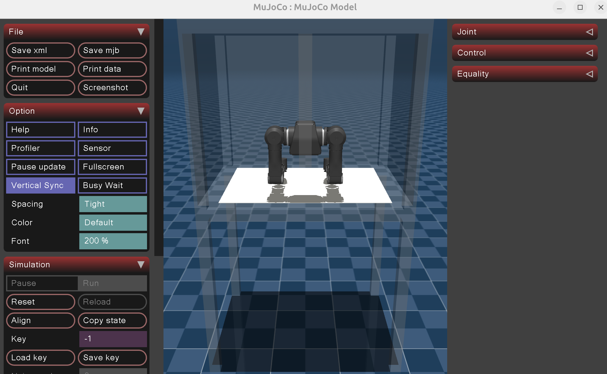

# dora-openarm-mujoco

MuJoCo simulation node for the [OpenArm](https://github.com/enactic/openarm_mujoco) bimanual robot, designed to run inside a [dora-rs](https://github.com/dora-rs/dora) dataflow.

It replaces the physical follower arms and cameras: it accepts joint-position commands and publishes arm observations and JPEG camera frames at the same interface as the real hardware.

## Installation

```bash
uv sync
```

## Quick start

A self-contained dummy dataflow is included for testing without real hardware.
It wires a dummy leader node to the MuJoCo sim and records to disk.

```bash
uv run dora build dataflow-dummy.yaml --uv
uv run dora run dataflow-dummy.yaml
```



## Dataflow configuration

### Minimal (headless and position forwarding only no cameras)

```yaml
- id: openarm-mujoco
  build: pip install -e .
  path: dora-openarm-mujoco
  inputs:
    position_right: leader/follower_position_right
    position_left:  leader/follower_position_left
  outputs:
    - status
    - arm_right_observation
    - arm_left_observation
```

### Full (interactive viewer + all cameras, with contacts, can be used for vr teleoperation)

```yaml
- id: openarm-mujoco
  build: pip install -e .
  path: dora-openarm-mujoco
  args: "--viewer --render --enable-collision --ctrl --keyframe home"
  inputs:
    position_right: leader/follower_position_right
    position_left:  leader/follower_position_left
  outputs:
    - status
    - arm_right_observation
    - arm_left_observation
    - camera_wrist_right
    - camera_wrist_left
    - camera_head_left
    - camera_head_right
    - camera_ceiling
```

## Inputs

| ID | Type | Description |
|----|------|-------------|
| `position_right` | `float32[8]` | Target joint positions for the right arm: joints 1–7 then the gripper. ~500 Hz. |
| `position_left` | `float32[8]` | Same layout for the left arm. |
| `pose_right` | `float32[7]` | VR controller pose `[x, y, z, qw, qx, qy, qz]`. Used only with `--debug-frames`. |
| `pose_left` | `float32[7]` | Same for the left controller. |

## Outputs

| ID | Type | Description |
|----|------|-------------|
| `arm_right_observation` | `float32[8]` | Observed joint positions, published per incoming command. |
| `arm_left_observation` | `float32[8]` | Same for the left arm. |
| `camera_wrist_right` | `uint8[N]` | JPEG frame, ~30 Hz. Requires `--render`. |
| `camera_wrist_left` | `uint8[N]` | JPEG frame, ~30 Hz. Requires `--render`. |
| `camera_head` | `uint8[N]` | JPEG frame, ~30 Hz. Requires `--render`. |
| `camera_ceiling` | `uint8[N]` | JPEG frame, ~30 Hz. Requires `--render`. |

Camera outputs carry `metadata={"encoding": "jpeg"}`.

## Arguments

Pass these via the `args:` field in the dataflow YAML, or directly on the command line.

| Argument | Default | Description |
|----------|---------|-------------|
| `--xml PATH` | bundled openarm_cell scene | MJCF scene file to load. |
| `--keyframe NAME` | `home` | Keyframe in the MJCF to reset to on startup. |
| `--enable-collision` | off | Enable contact/collision detection. Disabled by default to avoid unexpected joint-locking during teleoperation. |
| `--ctrl` | off | Write incoming positions to `data.ctrl` and step the physics (`mj_step`) to simulate actuator control. The default writes directly to `data.qpos` with `mj_forward`. |
| `--viewer` | off | Open the interactive MuJoCo viewer window. Requires a display. |
| `--render` | off | Enable offscreen camera rendering and publish JPEG frames. Leave off if cameras are not needed. |
| `--debug-frames` | off | Draw VR controller poses as coloured arrows in the viewer. Only visible with `--viewer`. |
