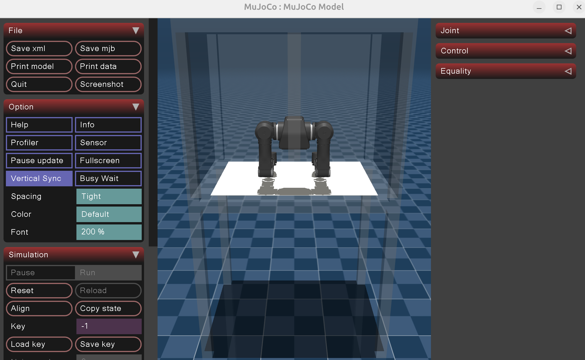

# dora-openarm-mujoco

MuJoCo simulation node for the [OpenArm](https://github.com/enactic/openarm_mujoco) bimanual robot, designed to run inside a [dora-rs](https://github.com/dora-rs/dora) dataflow.

It replaces the physical follower arms and cameras: it accepts joint-position commands and publishes arm observations and JPEG camera frames. The optional `--arm-interface openarm` mode exposes the same normalized position, state, and lifecycle interface as the physical OpenArm nodes.

## Installation

```bash
uv sync
```

## Quick start

A self-contained dummy dataflow is included for testing without real hardware.
It wires a dummy leader node to the MuJoCo sim and records to disk.

```bash
uv run dora build dataflow-dummy.yaml --uv
uv run dora run dataflow-dummy.yaml
```



## Dataflow configuration

### Minimal (headless and position forwarding only no cameras)

```yaml
- id: openarm-mujoco
  build: pip install -e .
  path: dora-openarm-mujoco
  inputs:
    position_right: leader/follower_position_right
    position_left:  leader/follower_position_left
  outputs:
    - status
    - arm_right_observation
    - arm_left_observation
```

### Full (interactive viewer + all cameras, with contacts, can be used for vr teleoperation)

```yaml
- id: openarm-mujoco
  build: pip install -e .
  path: dora-openarm-mujoco
  args: "--viewer --render --enable-collision --ctrl --keyframe home"
  inputs:
    position_right: leader/follower_position_right
    position_left:  leader/follower_position_left
  outputs:
    - status
    - arm_right_observation
    - arm_left_observation
    - camera_wrist_right
    - camera_wrist_left
    - camera_head_left
    - camera_head_right
    - camera_ceiling
```

### OpenArm-compatible arm interface

Use this mode to replace both physical arm nodes in an existing OpenArm dataflow:

```yaml
- id: openarm-mujoco
  build: pip install -e .
  path: dora-openarm-mujoco
  args: "--arm-interface openarm --scene demo"
  inputs:
    request_state: dora/timer/millis/4
    command: ui/arm_command
    position_right: action-mux/move_position_right
    position_left: action-mux/move_position_left
  outputs:
    - position_right
    - position_left
    - state_right
    - state_left
    - status_right
    - status_left
```

`start` enables arm commands and state publication; `stop` disables them. A
`request_state` event publishes position and state for both arms. `quit` emits
`stopped` and shuts down the simulator. The legacy interface remains the default.

## Inputs

| ID | Type | Description |
|----|------|-------------|
| `position_right` | `float32[8]` | Target joint positions for the right arm: joints 1–7 then the gripper. ~500 Hz. |
| `position_left` | `float32[8]` | Same layout for the left arm. |
| `request_state` | any | Publish both arm states in `--arm-interface openarm` mode. |
| `command` | `string[1]` | `start`, `stop`, or `quit` lifecycle command in `--arm-interface openarm` mode. |
| `pose_right` | `float32[7]` | VR controller pose `[x, y, z, qw, qx, qy, qz]`, expressed in the `--origin-frame` frame (default: the scene's `arm_origin` site). Used only with `--debug-frames`. |
| `pose_left` | `float32[7]` | Same for the left controller. |
| `button_x` | `bool[1]` | X button state. Edge-triggered: on press every scene joint on non-arm bodies (freejoint objects plus fixtures like drawers/doors) snaps back to the `--keyframe` pose; with `--randomize-objects` the freejoint objects land at a randomized pose instead. The button must be released to re-arm. |

## Outputs

| ID | Type | Description |
|----|------|-------------|
| `status` | `string["ready"]` | Legacy mode only; published once at startup. |
| `arm_right_observation` | `float32[8]` | Observed joint positions, published per incoming command. |
| `arm_left_observation` | `float32[8]` | Same for the left arm. |
| `position_right`, `position_left` | `struct<qpos: list<float32>>[1]` | Normalized arm positions in OpenArm mode. |
| `state_right`, `state_left` | normalized state struct | `qpos`, `qvel`, and generalized actuator torque from MuJoCo; unavailable temperature fields are zero. |
| `status_right`, `status_left` | `string[1]` | `stopped`/`started` lifecycle status in OpenArm mode. |
| `camera_wrist_right` | `uint8[N]` | JPEG frame, ~30 Hz. Requires `--render`. |
| `camera_wrist_left` | `uint8[N]` | JPEG frame, ~30 Hz. Requires `--render`. |
| `camera_head_left` | `uint8[N]` | JPEG frame, ~30 Hz. Requires `--render`. |
| `camera_head_right` | `uint8[N]` | JPEG frame, ~30 Hz. Requires `--render`. |
| `camera_ceiling` | `uint8[N]` | JPEG frame, ~30 Hz. Requires `--render`. |

Camera outputs carry `metadata={"encoding": "jpeg"}`.

## Arguments

Pass these via the `args:` field in the dataflow YAML, or directly on the command line.

| Argument | Default | Description |
|----------|---------|-------------|
| `--xml PATH` | unset | MJCF scene file to load. Overrides `--scene` when set. |
| `--scene NAME` | `cell` | Bundled scene to load when `--xml` is not set. Choices: `cell`, `demo`, `pedestal`, `bimanual`. |
| `--keyframe NAME` | `home` | Keyframe in the MJCF to reset to on startup. |
| `--randomize-objects [RANGE_M]` | off | Randomize freejoint scene objects (e.g. cubes) on startup and on each `button_x` reset: uniform xy offset within ±`RANGE_M` m of the keyframe pose plus a uniform yaw. `z` and articulated fixtures are unchanged. `RANGE_M` defaults to `0.05` when omitted. |
| `--enable-collision` | off | Enable contact/collision detection. Disabled by default to avoid unexpected joint-locking during teleoperation. |
| `--ctrl` | off | Write incoming positions to `data.ctrl` and step the physics (`mj_step`) to simulate actuator control. The default writes directly to `data.qpos` with `mj_forward`. |
| `--arm-interface MODE` | `legacy` | Arm I/O contract. Choices: `legacy`, `openarm`. |
| `--viewer` | off | Open the interactive MuJoCo viewer window. Requires a display. |
| `--render` | off | Enable offscreen camera rendering and publish JPEG frames. Leave off if cameras are not needed. |
| `--debug-frames` | off | Draw VR controller poses as coloured arrows in the viewer. Only visible with `--viewer`. |
| `--origin-frame NAME` | `arm_origin` | Frame incoming `pose_right`/`pose_left` are relative to; the overlay composes poses with its live world pose and draws the reference axes there. Pass `world` for raw world-frame poses. Missing frame → warning + world fallback. |
| `--origin-frame-type TYPE` | `site` | MuJoCo object type of `--origin-frame`. Choices: `body`, `site`, `geom`. |

### Environment variables

Every argument's default can also be set via an environment variable named
`DORA_OPENARM_MUJOCO_` + the upper-cased argument name:

| Environment variable | Argument |
|----------------------|----------|
| `DORA_OPENARM_MUJOCO_XML` | `--xml` |
| `DORA_OPENARM_MUJOCO_SCENE` | `--scene` |
| `DORA_OPENARM_MUJOCO_KEYFRAME` | `--keyframe` |
| `DORA_OPENARM_MUJOCO_ENABLE_COLLISION` | `--enable-collision` |
| `DORA_OPENARM_MUJOCO_CTRL` | `--ctrl` |
| `DORA_OPENARM_MUJOCO_VIEWER` | `--viewer` |
| `DORA_OPENARM_MUJOCO_RENDER` | `--render` |
| `DORA_OPENARM_MUJOCO_DEBUG_FRAMES` | `--debug-frames` |
| `DORA_OPENARM_MUJOCO_ORIGIN_FRAME` | `--origin-frame` |
| `DORA_OPENARM_MUJOCO_ORIGIN_FRAME_TYPE` | `--origin-frame-type` |

Boolean flags accept `1`/`0`, `true`/`false`, `yes`/`no` and `on`/`off`.
`DORA_OPENARM_MUJOCO_VIEWER` additionally accepts an FPS number
(e.g. `60`); `true` enables the viewer at the default 30 Hz.

Explicit CLI arguments override the environment. Boolean flags also gain a
`--no-*` form (e.g. `--no-render`, `--no-viewer`) to turn an
environment-enabled option back off. Set the variables via the `env:` field
of the node in the dataflow YAML:

```yaml
- id: openarm-mujoco
  path: dora-openarm-mujoco
  env:
    DORA_OPENARM_MUJOCO_VIEWER: "60"
    DORA_OPENARM_MUJOCO_RENDER: "true"
```

## License

Licensed under the Apache License 2.0. See [LICENSE](LICENSE) for details.

Copyright 2026 Enactic, Inc.

## Code of Conduct

All participation in the OpenArm project is governed by our [Code of Conduct](CODE_OF_CONDUCT.md).
